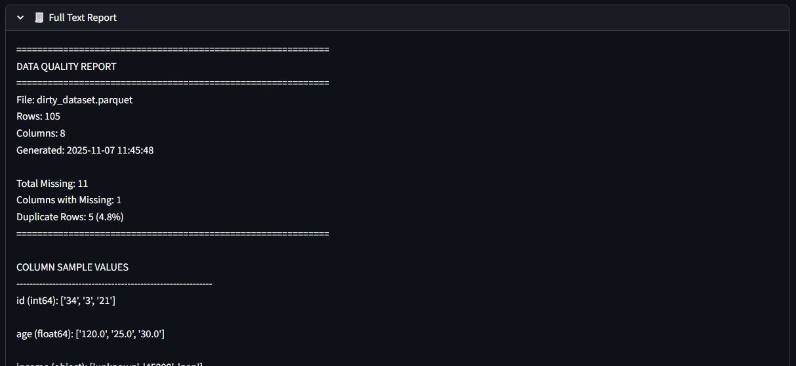
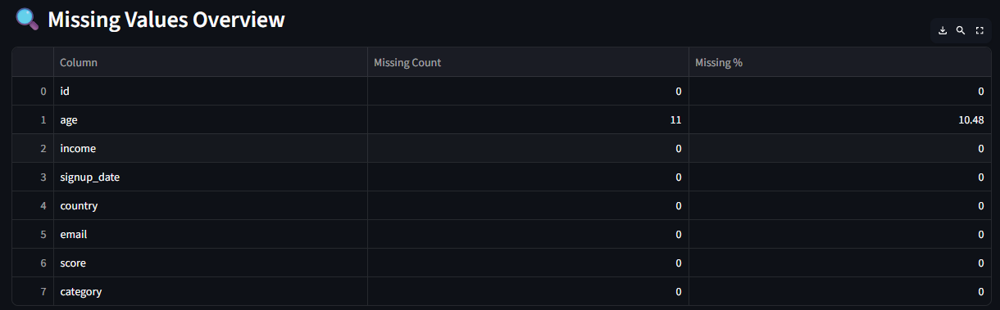
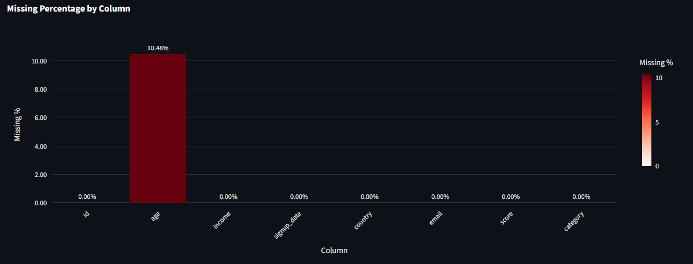
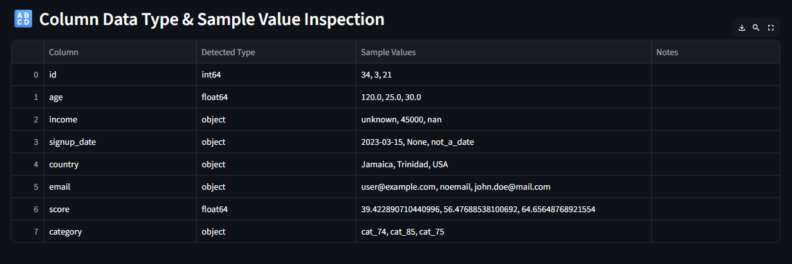
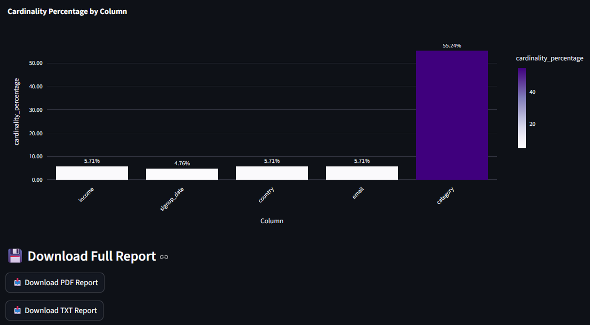

# Data Quality Checker

A Python-based tool for analyzing the quality of tabular datasets (CSV, Excel, or Parquet).  
It provides insights such as missing values, duplicates, data types, outliers, cardinality, column samples, and numeric summary statistics. The tool also generates a **PDF report** with recommendations for improving data quality.

## Live Demo

Try the live app here: [Data Quality Checker App](https://dataqualitycheckerjaheemedwards.streamlit.app/)

## Features

- Load datasets from CSV, Excel, or Parquet files.
- Inspect:
  - Missing values and percentages
  - Data types (numeric, categorical, datetime)
  - Duplicate rows
  - Numeric outliers (IQR method)
  - Column cardinality (unique values, high cardinality warnings)
  - Column sample values (detects possible numeric stored as string)
- Generate summary statistics including:
  - Count, mean, standard deviation, min, max
  - Skewness and kurtosis
- Export a PDF report containing:
  - Dataset overview
  - Missing values and duplicates

## Screenshots

  
  
  
  
  
    

## Installation

Clone the repository:

```bash
git clone <repository_url>
cd DataQualityChecker
```